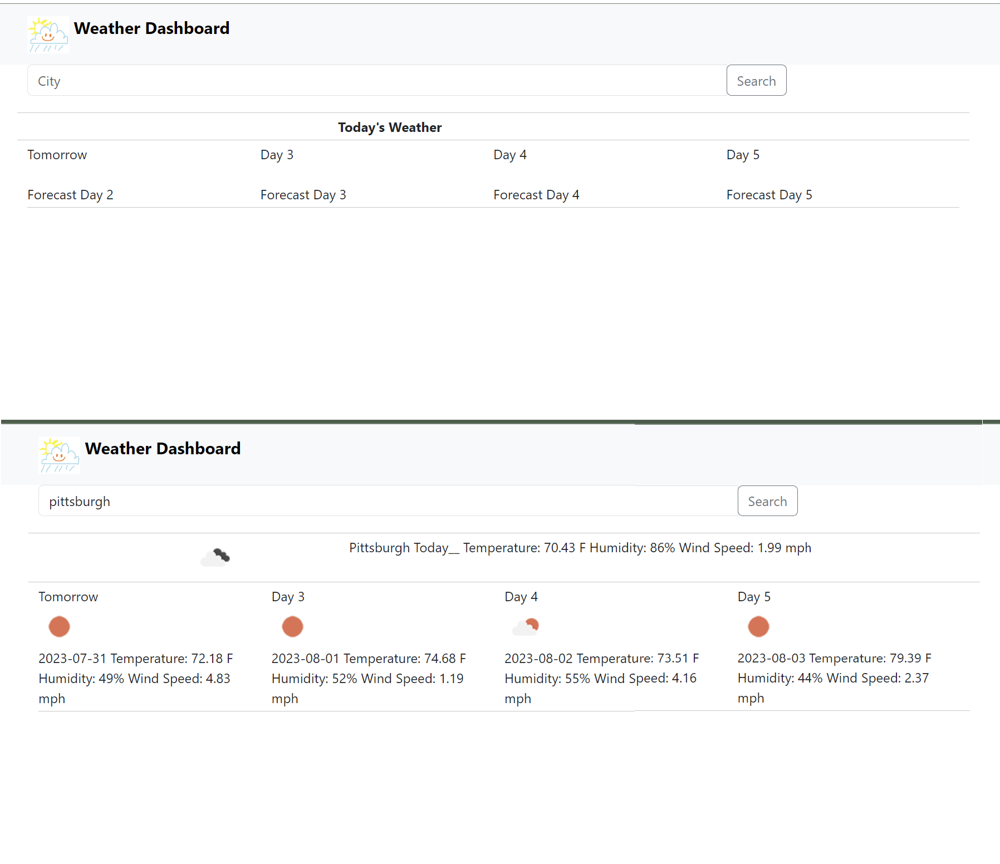

# Weather Dashboard, 
## Description
I built this project to provide a 5-day forecast for any given city, with a simple and clean interface. 
I learned a lot about time management! I also learned how to call and display specific information from an API, as well as more about working with Bootstrap. 

## Table of Contents
- [Installation](#installation)
- [Usage](#usage)
- [Credits](#credits)
- [License](#license)

## Installation
There are no required dependencies. 

## Usage
To use this project, go to the website:____________ . Enter the city name, and click "Search."

 

